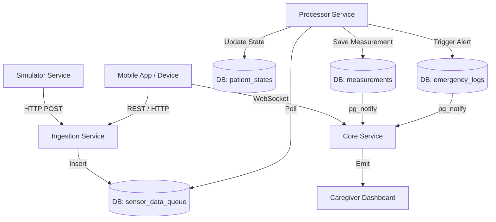
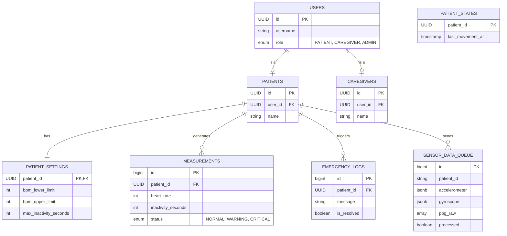

# System Architecture

## Overview
The CDTP Health Monitoring System is a real-time patient monitoring platform designed to ingest high-frequency sensor data, process it for anomalies (falls, arrhythmia, inactivity), and provide real-time alerts to caregivers.

The system is built as a set of microservices orchestrated via Docker Compose, utilizing a shared PostgreSQL database for persistence and inter-service communication (via `pg_notify`).

## High-Level Architecture



## Services

### 4. Simulator Service (New)
- **Type**: Test Utility / Data Generator
- **Responsibility**: Generates synthetic sensor data (accelerometer, gyroscope, PPG) to mimic a patient device.
- **Behavior**: 
    - Sends data to **Ingestion Service** at 5Hz.
    - Simulates "Normal", "High Heart Rate", and "Fall" scenarios cyclically.
    - Configurable via `PATIENT_ID` and `FREQUENCY_HZ` environment variables.

### 1. Ingestion Service
- **Type**: High-Throughput API
- **Port**: 8001
- **Responsibility**: Receives raw sensor data packets from patient devices.
- **Key Endpoint**: `POST /api/v1/ingest`
- **Data Flow**: Queues payload directly into `sensor_data_queue` without blocking for processing. Uses `asyncpg` for minimal latency.

### 2. Processor Service
- **Type**: Background Worker
- **Responsibility**: Consumes data from the queue and executes health algorithms.
- **Workflow**:
    1.  **Poll**: Fetches unprocessed rows from `sensor_data_queue` using `FOR UPDATE SKIP LOCKED`.
    2.  **Context**: Fetches patient state (e.g., last movement time).
    3.  **Analyze**: Runs algorithms:
        *   `detect_fall(accelerometer)`
        *   `calculate_bpm(ppg)`
        *   `check_inactivity(accelerometer)`
    4.  **act**: Updates `patient_states`, saves `measurements`, and logs `emergency_logs` if critical.

### 3. Core Service
- **Type**: Application API & Real-time Gateway
- **Port**: 8000
- **Responsibility**: Manages user data, settings, and delivers real-time updates.
- **Features**:
    *   **REST API**: Auth, Patient Management, Dashboard stats.
    *   **WebSockets (Socket.IO)**: Listens to PostgreSQL `LISTEN/NOTIFY` channels and broadcasts updates to connected clients.

## Database Schema

The system uses PostgreSQL 15 as the single source of truth and message broker.



## Data Lifecycle

### 1. Ingestion Phase
Raw data arrives at the **Ingestion Service**.
```json
{
  "patient_id": "uuid...",
  "accelerometer": {"x": [], "y": [], "z": []},
  "gyroscope": {"x": [], "y": [], "z": []},
  "ppg_raw": [100, 102, ...],
  "timestamp": 1709420000.0
}
```
Is stored immediately in `sensor_data_queue`.

### 2. Processing Phase
The **Processor Service** picks up the record.
1.  **Fall Detection**: Checks accelerometer spikes.
2.  **BPM**: Calculates heart rate from PPG data.
3.  **Inactivity**: Compares current movement against `patient_states.last_movement_at` and `patient_settings.max_inactivity_seconds`.

### 3. Action Phase
- If **Safe**: Saves to `measurements` with status `NORMAL`.
- If **Risk**: Saves to `measurements` with status `WARNING` or `CRITICAL`.
- If **Emergency** (Fall detected): Inserts into `emergency_logs` with "FALL DETECTED".

### 4. Notification Phase
PostgreSQL Triggers/Notification mechanism:
1.  `MeasurementService` executes `NOTIFY measurement_updates, 'payload'`.
2.  `MeasurementService` executes `NOTIFY alert_updates, 'payload'`.
3.  **Core Service** (via `socket_manager.py`) receives the event.
4.  Socket server emits `new_measurement` or `new_alert` to frontend.

## Key Logic Components

### Algorithms (`services/processor/algorithms.py`)
- **Isolation**: Pure functions taking raw data and returning metrics.
- **Fall Detection**: Threshold-based analysis on vector magnitude.
- **Inactivity**: Time-difference calculation between strictly moving frames.

### Shared Logic (`shared/measurement_service.py`)
- **Centralization**: Used by both Core (for manual updates/tests) and Processor.
- **Pipeline**: `Get Settings` -> `Evaluate` -> `Save` -> `Notify`.

## Deployment
The stack is containerized via Docker Compose:
- `db`: PostgreSQL volume persistent.
- `core`, `ingestion`, `processor`: Python services built from their respective directories.
- Network: Internal bridge network `cdtp-network`.
